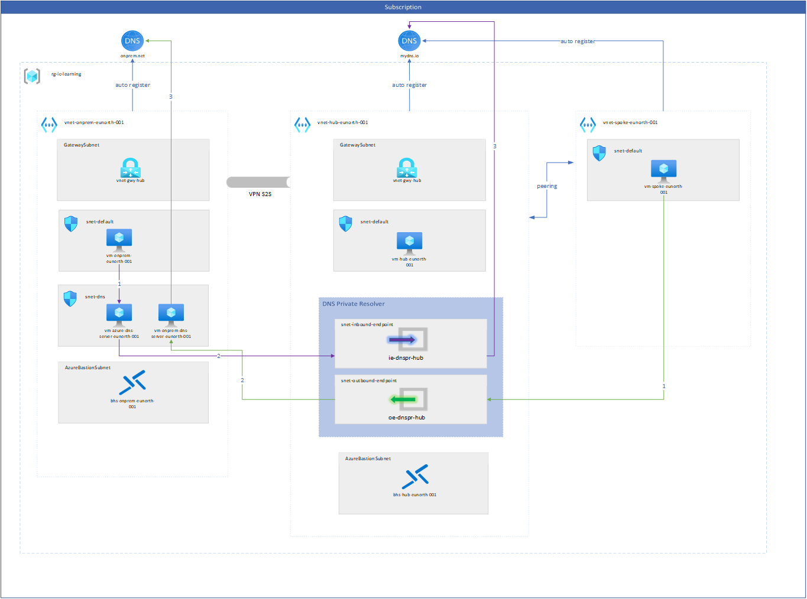
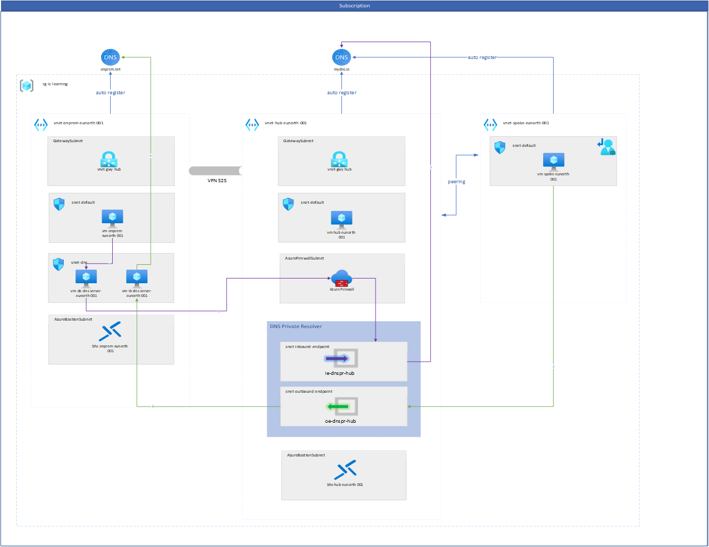

# DNS Private Resolver

This repository contains various terraform modules to create a Azure Hub and Spoke architecture testing Azure Private DNS Resolver. The architecture diagram below illustrates the components and the DNS traffic flow.

NOT included in the deployment is the DNS Private Resolver since the terraform resoure is not available yet.




The setup also deploys an Azure Firewall (not routes are added on the spoke subnets) to use it as a DNS Proxy for DNS queries from on-prem to Azure to monitoring it. The DNS proxy of the firewall needs to be configured manually. 



## File Structure


## Prerequesite

Before starting off with the deployment - don't forget to authenticate with the `provider.tf` file. Either using a service principal or using default Azure credentials from command line.

## Usage

```
# Initialize terraform
terraform init

terraform plan

terrafrom apply
```

## Other resources

tbd
